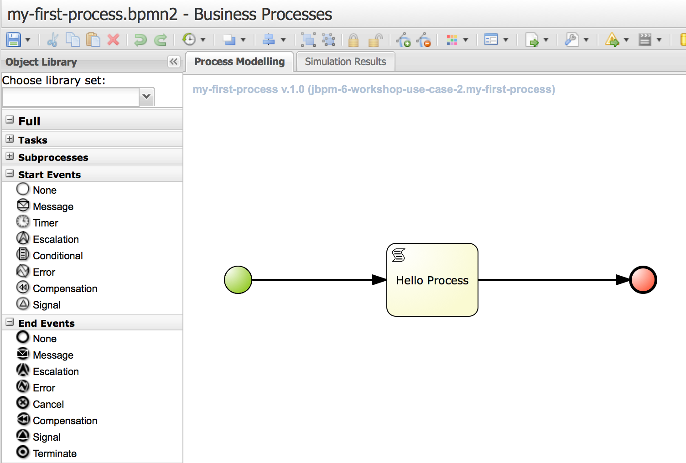
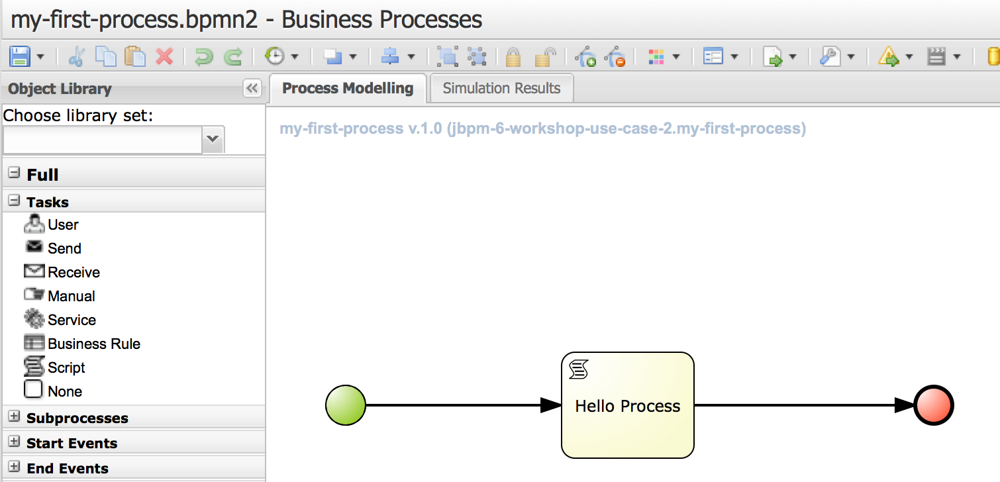
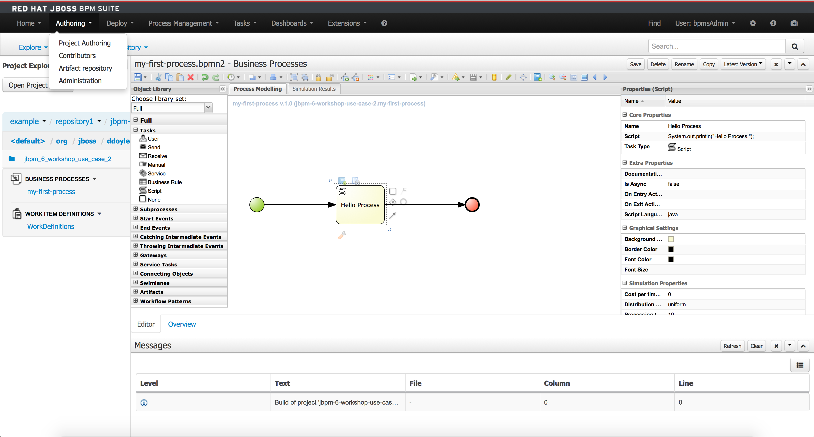
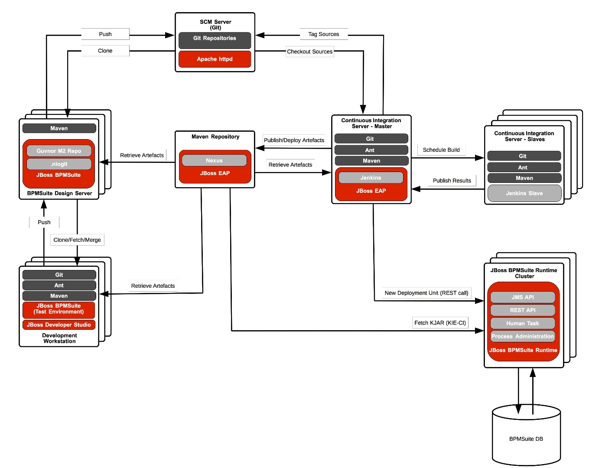
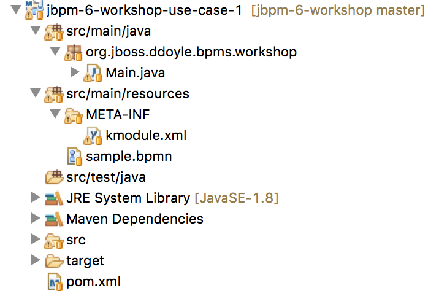
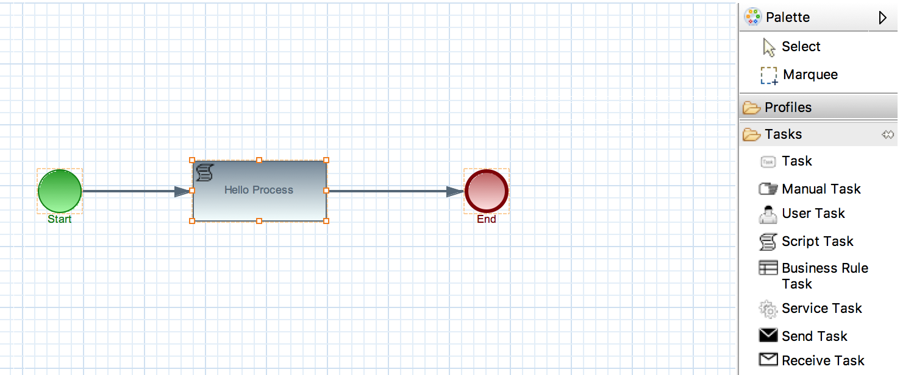
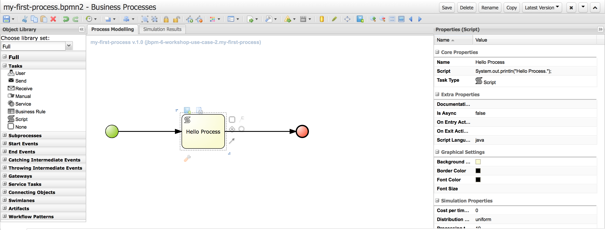

= jBPM 6 Workshop

Business Process Management:: _Business process management (BPM) is a field in operations management that focuses on improving corporate performance by managing and optimising a company's business processes._ 

== BPMN 2.0

Business Process Model and Notation (BPMN) is a graphical representation for specifying business processes in a business process model.

Business Process Management Initiative (BPMI) developed BPMN, which has been maintained by the Object Management Group since the two organizations merged in 2005. Version 2.0 of BPMN was released in January 2011,[1] at which point the name was adapted to Business Process Model and Notation as execution semantics were also introduced alongside the notational and diagramming elements.

=== Elements
jBPM6 does not implement all elements and attributes as defined in the BPMN 2.0 specification. 

It does however support a significant subset, including the most common node types that can be used inside executable processes. This includes (almost) all elements and attributes as defined in the "Common Executable" subclass of the BPMN 2.0 specification, extended with some additional elements and attributes we believe are valuable in that context as well. The full set of elements and attributes that are supported can be found below, but it includes elements like:

* Flow objects
** Events
*** Start Event (None, Conditional, Signal, Message, Timer)
*** End Event (None, Terminate, Error, Escalation, Signal, Message, Compensation)
*** Intermediate Catch Event (Signal, Timer, Conditional, Message)
*** Intermediate Throw Event (None, Signal, Escalation, Message, Compensation)
*** Non-interrupting Boundary Event (Escalation, Signal, Timer, Conditional, Message)
*** Interrupting Boundary Event (Escalation, Error, Signal, Timer, Conditional, Message, Compensation)
** Activities
*** Script Task
*** Task
*** Service Task
*** User Task
*** Business Rule Task
*** Manual Task
*** Send Task
*** Receive Task
*** Reusable Sub-Process (Call Activity)
*** Embedded Sub-Process
*** Event Sub-Process
*** Ad-Hoc Sub-Process
*** Data-Object
** Gateways
*** Diverging
**** Exclusive
**** Inclusive
**** Parallel
**** Event-Based
*** Converging
**** Exclusive
**** Inclusive
**** Parallel
* Lanes
* Data
** Java type language
** Process properties
** Embedded Sub-Process properties
** Activity properties
* Connecting objects
** Sequence flow

=== JBoss BPMSuite Business-Central

The main design-time, runtime and management environment of JBoss BPMSuite is the Business-Central platform. Business-Central is shipped and installe out-of-the-box with both JBoss BRMS and JBoss BPMSuite, where the provided functionality of the version in JBoss BRMS is a subset of the functionality provided in JBoss BPMSuite.

Business-Central provides the following functionality:

* Authoring
** Project Authoring
*** Project Editor
*** Guided Rule Editor
*** Decision Table Editor
*** Business Process Editor
** Repository Management (Maven)
** Administration
*** Organizational Unit
*** Source Repository (Git)
* Deployment
** Process Deployments
** Rule Deployments
** Jobs (asynchronous execution).
* Process Management
** Process Definitions
** Process Instances
* Tasks
** Task List
* Dashboards
** Process and Task Dashboard
** Business Dasboards
* Extensions
** PlugIn Management
** Apps
** Data Sets

Business Central provides all basic functionalities to author, deploy and run processes. It contains its own SCM system (Git), it's own artefact repository (Maven), it's own deployment server and it's own process runtime, all in a single JBoss BPMSuite instance. This allows one to run the full BPMSuite platform, both design, runtime and management environment, from a single BPMSuite installation.

In a customer's existing IT landscape, JBoss BPMSuite will most likely need to be integrated within an existing architecture. The IT environment will most likely already have a corporate defined SCM system (Git, Subversion, ClearCase, Perforce, etc.), a Continuous Integration and/or build environment, an artefact repository, etc. 

To accomodate for these environments, we can create more specific architectures that integrate JBoss BPMSuite with enterprise IT environments. We will first discuss the BPMSuite Design-time Architecture. This architecture shows how existing CI-servers, Maven repository-managers, etc. can be utilized in combination with JBoss BPMSuite.

==== BPMSuite Design Server
In this architecture we separate the design time (Guvnor, jBPM designer, guided-rule-editor, etc.) from the BPMSuite runtime environment. Reason for this is that:

* We want to separate design-time and runtime concerns, which gives us more flexibility with regards to, for example, scalability.
* We want to integrate with a centralised corporate SCM.
* We don't utilise the internal build and deploy capabilities from BPMSuite to transition design time artefacts (BPMN process definition, drl, etc.) to the runtime (KJAR deployment). Instead, we integrate with an existing CI environment.
 
===== Git Repository
The BPMSuite Design Server's Git repositories are cloned from a central Git/SCM. This implies that the BPMSuite and BRMS development artifacts are maintained in the central SCM, and not in the BPMSuite repositories. This has the advantage that the BPMSuite repository does not need to be managed by a corporate SCM team, that all development artifacts are stored in a centrally managed environment, that existing SCM policies can be used and that existing integration with corporate CI systems can be re-used.
 
The implication of this choice is that changes committed to the BPMSuite Git repository by the BPMSuite components (designers, editors, etc.) need to be pushed to the central repository (i.e. remote origin). How this is done can be decided by the customer, but in general we see two possible approaches:

* Automatically: push to remote origin via a commit hook on the BPMSuite cloned repository. I.e., on each commit to the repository, the change is automatically pushed to remote. Please note that Git hooks are not yet available/supported in the BPMSuite Git implementation: https://bugzilla.redhat.com/show_bug.cgi?id=1066962
* Manually: the commits on the BPMSuite Git repository are manually pushed to remote origin. This gives more control over the commit process and allows the person responsible to decide when changes are to be pushed to origin and thus when these changes are available to the build process.

Note: for this concept to properly work, only the BPMSuite Design Servers are allowed to push to origin. The reason for this is that there is currently no possibility in BPMSuite to fetch and merge/rebase changes from remote. By only allowing the BPMSuite Design Server to commit to remote, we prevent to end up in a situation where we need to pull external changes into the BPMSuite Design environment.
 
===== Maven Repository
The BPMSuite internal Maven repository, to which BPMSuite by default deploys the KJARs that it builds, is in this architecture only used to deploy KJARs when one presses the 'Build& Deploy' button in the Project Editor. It can thus be used as the repository from which to deploy the KJAR on the Design Server, for example to manually test the process. However, it is not used as the repository to which the final build artifacts are published. Instead, we will use a central artifact repository (e.g. Nexus) to store and manage the KJARs.
 

==== Development Workstation
The development workstation is setup with JBoss Developer Studio and the JBDS Integration Stack (which provides the Drools and jBPM editors). This allows the more technical developers to work on BPMSuite projects and development artifacts from within their IDE. To work on the BPMSuite projects, it is required that the developers work on a Git repository which is cloned from BPMSuite, not from the central SCM. The reason for this is, as we explained in the previous section, that we only allow the BPMSuite Design Server to push changes to the central SCM, to prevent having to fetch changes from the central SCM into the BPMSuite repository.
 
Developers can build and test their projects using Maven. All required Maven artifacts (libraries, frameworks, datamodels) are stored and managed in the central artifact repository (e.g. Nexus). Therefore, there is no requirement to configure the BPMSuite Maven repository as a remote repository in the Maven configuration on the development machines.
 
==== SCM Server
Most of the time, enterprises already have a corporate policy with regards to source code management and version control. In larger companies, dedicated teams are responsible for the administration and management of these environments, usually combined with the responsibility for the centralized build environments, configuration management and release and deployment management. Hence, larger enterprises often have the requirement that all source code/development artifacts are stored in the corporate SCM environment.
 
This architecture satisfies this requirement by storing all BPMSuite in the central SCM, making the SCM the 'source of truth' of all BPMSuite artifacts. The Continuous Integration environment monitors the central SCM and fetches the sources from the central SCM.
 
For a customer implementation, see BxMS Git Workflow At Genworth and JBoss BPMS Design Time & Development Architecture.
 
==== Continuous Integration Server
The Continuous Integration server's responsibility is to scan (via polling or notifications) the SCM Server for changes to the source code and development artefacts (BPMN2 files, rules, etc.). When one or more of these artefacts change, a new build of the project is started. Such a build wil:
Pull down the new project artefacts from the SCM.
Start a Maven build to build the KJAR, which will usually:

* Compile the artefacts.
* Test the artefacts (e.g. via JUnit and/or TestNG).
* Build the KJAR.
* Install the KJAR in the local Maven2 repository.
* Deploy the KJAR to the central Maven Artefact Repository.
 
Optionally, the CI server can also:

* Generate documentation for the current build (e.g. JavaDoc).
* Generate quality metrics and reports (e.g. PMD, CheckStyle, possibly integrated in a quality platform like SonarQube).
* Kick-off a CD deployment-pipeline/build-pipeline, that:
* Deploys the KJAR on a BPMSuite runtime.
* Executes integration tests
* Propagates the KJAR through Test/Acceptance Production.
 
Again, enterprises nowadays usually already have a centralised software build environment and continuous integration server, operated by dedicated teams. Therefore, in this architecture we don't make any assumptions with regards to the CI server used. This concept can be implemented on various platforms like Jenkins, Bamboo, TeamCity, etc.
 
==== Artifact Repository (Maven)
JBoss BRMS and BPMSuite rules and processes are packaged in KJARs and referenced and deployed using Maven GAVs. As Maven is the packaging and deployment mechanism of JBoss BRMS and BPMSuite, we can utilize any Maven artefact repository to store and manage our BxMS artefacts. The Maven repository that is shipped out-of-the-box with BxMS is a repository with limited functionality. By utlizing a more enterprise class Maven repository manager, like Nexus, Artifactory, Archive, etc., we can add a more sophisticated BxMS artifact management to our architecture. 

=== BxMS Design Time clustering
Clustering of the JBoss BxMS design-time environment mainly deals with clustering of the BxMS Git back-end. In the design-time environment, the BPMSuite database is not really used. The BPMSuite database is mostly used in the runtime environment to store process runtime data and process history data.

In the design-time environment, clustering deals with clustering of the asset repository (Git). The asset repository is a Git backed virtual filesystem (VFS). To keep the Virtual File Systems in-sync between the various BPMSuite nodes, BPMSuite utilizes the following open-source projects:

* Apache Zookeeper
* Apache Helix

Helis is teh cluster management component that registers all cluster details (cluster, nodes, resources, etc.) and Zookeeper is responsible for glueing all parts together.

More information BPMSuite clustering can be found http://planet.jboss.org/post/clustering_in_jbpm_v6[here]

=== BPMSuite Runtime Architecture

==== Business Central
Apart from design-time components, Business Central also provides the deployment and runtime componens of JBoss BPMSuite. KJARs with process definitions can be deployed on the JBoss BPMSuite platform and started from the BPMSuite user interface. Business Central contains:

* Deployment interface: provides the capability to deploy any KJAR onto the BPMSuite runtime environment.
* Process Definitions interface: list available process definitions and provide availability to start a process.
* Process Instances interface: list and manage active, completed and aborted process instances. 
* Tasks List: manage Human Tasks 
* Dashboards: Business Process Monitoring and Business Activity Monitoring (BAM) dashboards.

===== REST interface
Apart from the UIs provided by Business Central, the platform also provides a number of supported remoting protocols that allow process and task management (e.g. start, stop, signal) from remote clients:

* Remote Java API: The Remote Java API provides `KieSession`, `TaskService` and `AuditService` interfaces to the JMS and REST APIs. The interface implementations provided by the Remote Java API take care of the underlying logic needed to communicate with the JMS or REST APIs. In other words, these implementations will allow you to interact with a remote workbench instance (i.e. KIE workbench or the jBPM Console) via known interfaces such as the KieSession or TaskService interface, without having to deal with the underlying transport and serialization details.
* REST API: allows any remote RESTful client to interact with the Business-Central platform to deploy KJARs, start processes, claim human tasks, complete human tasks, etc. The RESTful APIs are defined in the 
* REST Query API: allows remote RESTful clients to _richly_ query the process engine.
* JMS API: interact with the process engine using JMS. This API does not provided functionality to manage deployments (i.e. deploy and/or undeploy KJARs).

More information about the jBPM remoting interfaces can be found https://docs.jboss.org/jbpm/v6.3/userguide/ch17.html[here].

==== Deployments
Process definitions are packages in KJARs. To deploy a process on the runtime platform, we therefore need to deploy a KJAR on the Business Central platform.

When doing a deployment in JBoss BPMSuite, we deploy a KJAR using its Maven GAV (GroupId, ArtifactId, Version). In fact, when performing a deployment, we don't really deploy the actual artifact onto the platform. Instead, we actually register the Maven GAV on the platform (using GUI, REST interface or any other supported mechanism). The platform itself will construct a `KieContainer` with the given `ReleaseId`, on which the platform will fetch the artefact, and its dependencies, from the Maven repository.

=== KIE Execution Server

Until JBoss BPMSuite 6.2, the only out-of-the-box environment on which processes could be deployed and executed was the Business Central platform. In 6.2, a new, unified, KIE Execution Server (or Decision Server) was introduced that allows KJARs to be deployed and processes to be executed on a more lightweight container (big benefit: cloud and container deployments).

The KIE Execution Server was already available in JBoss BRMS/BPMSuite 6.1, but was only targetted at running rules. In version 6.2, the Execution Server can now also run processes. This allows for a more clean seperation of the Business Central design-time environment and the actual process runtime environmnet. I.e the instances can be individually scaled based on the requirements, we no longer need to deploy a fulle design-time environment in production to run process instances, etc.

An additional advantage is that the process execution environment is now a lot more lightweight, allowing us to more easily package process runtime environments in, for example, Docker containers to be deployed on OpenShift v3.

Maciej Swiderski, jBPM core engineer has created an excellent article serie on the new, unified, KIE Execution Server: 

http://mswiderski.blogspot.nl/2015/09/unified-kie-execution-server-part-1.html
http://mswiderski.blogspot.nl/2015/09/unified-kie-execution-server-part-2.html
http://mswiderski.blogspot.nl/2015/09/unified-kie-execution-server-part-3.html
http://mswiderski.blogspot.nl/2015/09/unified-kie-execution-server-part-4.html

==== KIE Execution Server and Containers
On a KIE Execution Server one can deploy 1 or more _Containers_, where a Container is basically a _KieContainer_ which references a KJAR through a Maven GAV. I.e. one can create a Container per KJAR and assign multiple containers to a single KIE Execution Server. As with Business Central, the artefact is thus deployed by simply poiting the platform to a specific Maven GAV, on which the platform will fetch the actual artefact from the Maven repository. 

==== KIE Execution Server: Operational Modes
Basically, the Execution Server can operate in 2 modes:

* Standalone: in this mode, the execution server is not managed by a central environment. Containers are created and managed directly on the kie-server itself.
* Managed: in this mode, the architecture contains one or more kie-server controllers to which the kie-servers connect. Creation, configuration and deployment of Containers on kie-servers is managed from the central environment through the controllers.

In Standalone mode, administration of which containers are created, their configuration, etc. is maintained in a file on the filesystem of the host that runs the kie-server.

==== Some KIE Server REST commands
This paragraph will list a number of REST commands that allow one to interact with the kie-server and the controller nodes

* List process definitions deployed on a KIE Execution Server container: GET http://localhost:8080/kie-server/services/rest/server/queries/processes/definitions
* List kie-server configuration: GET http://localhost:8080/kie-server/services/rest/server/
* List containers deployed on a kie-server: GET http://localhost:8080/kie-server/services/rest/server/containers
* Create a new container on a kie-server (Standalone): PUT http://localhost:8080/kie-server/services/rest/server/containers/{container-name}

_REQUEST_
[source,xml]
----
<?xml version="1.0" encoding="UTF-8" standalone="yes"?>
<kie-container container-id="mycontainer">
    <release-id>
        <group-id>org.jboss.ddoyle</group-id>
        <artifact-id>MyFirstProject</artifact-id>
        <version>1.0.0</version>
    </release-id>
</kie-container>
----

* Create a process instance: POST http://docker-dev:32827/kie-server/services/rest/server/containers/{container-id}/processes/{process-id}/instances

If the process accepts process input variables, one can pass them as XML in the request body.
_REQUEST_
[source,xml]
----
<?xml version="1.0" encoding="UTF-8" standalone="yes"?>
<map-type>
    <entries>
        <entry>
            <key>age</key>
            <value xsi:type="xs:int" xmlns:xs="http://www.w3.org/2001/XMLSchema" xmlns:xsi="http://www.w3.org/2001/XMLSchema-instance">25</value>
        </entry>
        <entry>
            <key>name</key>
            <value xsi:type="xs:string" xmlns:xs="http://www.w3.org/2001/XMLSchema" xmlns:xsi="http://www.w3.org/2001/XMLSchema-instance">john</value>
        </entry>
    </entries>
</map-type>
----

* Retrieve a process image: GET http://localhost:8080/business-central/rest/runtime/{deploymentId}/process/{process-id}/image

(Note that this requires the _storesvgonsave_ property to be set to _true_ in _jboss-eap-6.4/standalone/deployments/business-central.war/org.kie.workbench.KIEWebapp/profiles/jbpm.xml_, which enables auto-save of the process image when the BPMN2 model is saved in the designer).

=== Maven Deployments
As stated earlier, KJARs are not actually deployed on Business-Central/Kie-Execution-Server. Instead, the a Maven GAV is provided to the platform, which well then fetch the artefact, and its dependencies, from the Maven repository.

By default, JBoss BPMSuite is configured to reference and use its own, internal, Maven repository. This is very convenient for a simple, out-of-the-box, setup. When one presses the _Build and Deploy_ button in the designer, the Maven artefact is built on the Business-Central platform and uploaded (deployed) to the internal Maven repository, from which the platform can fetch the artefact when a Maven GAV is deployed onto the runtime.

In an enterprise scenario, in which one might already use a more sophisticated Maven repository manager, this solution is most-likely not appropriate. In these kind of scenerio's we would actually want JBoss BPMSuite to interface with the central Maven repository.

Luckily, the Maven configuration of JBoss BPMSuite is highly customizable. In fact, it adheres to he de-facto Maven standards and can be configured using a Maven _settings.xml_ file. In a _settings.xml_ we can configure from which (remote) repositories JBoss BPMSuite cam retrieve its artefacts, just like with any other Maven client.

The _settings.xml_ file to be used by JBoss BPMSuite can be configured using the _kie.maven.settings.custom_ System Property, which can be passed, for example, via the command-line when starting the JBoss EAP container, or which can be configured in a JBoss EAP profile.

== Designing jBPM Processes

jBPM/BPMSuite processes are defined in BPMN2, the Business Process Modeling and Notation standard which defines a graphical notation and execution model for business processes. As jBPM uses the BPMN2 standard, process definitions can be created using a variety of tools that support the BPMN2 standard. Out-of-the-box, BPMSuite provides the following editors:

* JBoss Developer Studio / Eclipse BPMN2 editor: a BPMN2 editor available in the JBDS IDE.
* JBoss BPMSuite Business Central web-editor: a web-based BPMN2 editor available in the JBoss BPMSuite Business Central console.

Both editors provide more or less the same functionality and allow to use the BPMN2 elements discussed earlier in this workshop.

=== JBoss Developer Studio

A business process is defined in BPMN2. A BPMN2 file in KIE/Drools/jBPM is regarded, like a _.drl_, _.xls_, _.dsl_, etc., as a Drools https://docs.jboss.org/jbpm/v6.3/javadocs/org/kie/api/io/ResourceType.html[ResourceType]. Hence, a BPMN2 file is defined, stored and loaded into a `KieBase` in exactly the same way as any other Drools ResourceType.

To define a BPM process, a _.bpmn_ file should be created in the _src/main/resources_ directory of a Java project, the project from which we will create a _KJAR_. Next to this _.bpmn_ file, we need to define a _kmodule.xml_ in the _src/main/resources/META-INF_ directory.

== Business Central Process Editor
The product also provides a process editor in the Business Central console. The editor operates directly on the Git asset repository of the platform. The editor will open automatically when one creates a new business process, or when one selects an existing business process.

== jBPM APIs

jBPM 6 (and 5) evolved out of a project called _Drools Flow_, a project that provided workflow or (business) process capabilities to the Drools platform. As such, the jBPM, like Drools, also uses the common *KIE* API, where KIE stands for *Knowledge Is Everything*.

As BRMS and BPMSuite share a common ground, the storage (process definition and rule repository), build management, deployment and runtime components are mostly the same. Both engines are built on top of the *KIE* API, both platforms use the *Business Central* consoles (editors, builds, deployment and runtime management), both platforms use *Git* for design-time artifact storage (rules, process definitions, etc.) and both platforms use Maven as the build and deployment management platform.

=== The KIE API and jBPM
We've already discussed the *KIE* API in great detail in the *jboss-brms-6-workshop*, so we will not discuss it in-depth here. Instead, we will focus on those parts of the API that are most relevant to jBPM and JBoss BPMSuite

The JavaDoc for the API can be found http://docs.jboss.org/drools/release/latest/kie-api-javadoc/index.html[here].

jBPM is a very lightweight process engine. It consists mainly of a couple of small JAR files (e.g. jbpm-bpmn2-{version}.jar, jbpm-flow-{version}.jar, etc.) and can run in a number of different modes.

==== In-Memory Process Execution
We've already discussed the Business-Central server and KIE-Execution server on which we can deploy and run our processes in a managed environment, including support for things like transacions and persistence. However, the most simple way of running jBPM is in-memory, in a simple Java-SE application, without any form of persistence and/or transactions. In this mode, the process will run in-memory and should not contain any, so-called, wait-states. I.e. from process-start to process-end should be one continuous flow of execution, without requiring any additional input (e.g. Human Task completion, external signals, etc.).

As we know, jBPM and BPM in general deals with stateful, long-running processes. In our Drools/BRMS workshop we've mostly worked with stateless data, i.e. spinning up a `KieSession`, inserting data (facts) into the session, firing the rules, collecting the results and disposing the session. With jBPM, we can do the same thing, as long as the process does not have any wait-states. I.e. the process can run from start to finish, completely in memory, without requiring any external input after the process has started.

Obviously, this is not your everyday use-case for a BPM process, however, it does show the concept of running a BPM process inside jBPM/KIE.

In this mode, the API being used is just the plain http://docs.jboss.org/drools/release/latest/kie-api-javadoc/org/kie/api/runtime/KieSession.html[KieSession] API. Just as wiht a Drools project, the `.bpmn` file (a Drools Resource) is placed in the `src/main/resources` directory, accompanied by a `kmodule.xml` file in the `src/main/resources/META-INF` directory. A `KieSession` is created in the exact same way as with a Drools project, using the http://docs.jboss.org/drools/release/latest/kie-api-javadoc/org/kie/api/KieServices.html[KieServices] and http://docs.jboss.org/drools/release/latest/kie-api-javadoc/org/kie/api/runtime/KieContainer.html[KieContainer]. To start a process, simply call `kieSession.startProcess(String processId)`.

===== Lab 1
In this first Lab, we will explore how to create and start a very simple jBPM process from JBoss Developer Studio. Import the *jbpm-6-workshop-use-case-1* project into JBoss Developer Studio (Import -> Existing Maven Projects). This project already contains a `Main` class with some of the required code to load a `KieContainer`. Furthermore, the project is fully configured with all required Maven dependencies to run a process. Finally, a `kmodule.xml` file has already been pre-configured in the`src/main/resources/META-INF` directory.

The task is simple:

* Create a very simple BPMN2 process file in the `src/main/resources' directory.
* Create a process that has a _start-node_, a _script-task-node_, and an _end_node_.
* Configure the _script-task-node_ to print "Hello Process".
* Finish the code in the `Main` class to create a `KieSession` from the `KieContainer`, start the process and dispose the `KieSession`.

=== kmodule.xml
As with BRMS, the KieBase and KieSession configurations of a jBPM/BPMSuite KJAR can be configured in a _kmodule.xml_ configuration file. The _kmodule.xml_ allows use to configure things like:

* default `KieBase` and `KieSession`.
* `KieBase` equality behaviour.
* `KieSession` clock-type.
* `KieSession` EventListeners
* `KieSession` WorkItemHandlers.

[source,xml]
----

<kmodule xmlns:xsi="http://www.w3.org/2001/XMLSchema-instance" xmlns="http://jboss.org/kie/6.0.0/kmodule">

  <kbase name="defaultKieBase" default="true" eventProcessingMode="cloud" equalsBehavior="identity" declarativeAgenda="disabled" scope="javax.enterprise.context.ApplicationScoped" packages="*">

    <ksession name="defaultKieSession" type="stateful" default="true" clockType="realtime" scope="javax.enterprise.context.ApplicationScoped">
        <workItemHandlers>
            <workItemHandler name="CustomTask" type="FQCN_OF_HANDLER" />
        </workItemHandlers>
        <listeners>
            <listener type="FQCN_OF_EVENT_LISTENER" />
        </listeners>
    </ksession>
    <ksession name="defaultStatelessKieSession" type="stateless" default="true" clockType="realtime" scope="javax.enterprise.context.ApplicationScoped"/>

  </kbase>

</kmodule>
----

=== jBPM Deployment Descriptor
Apart from the configuration options available in the _kmodule.xml_, jBPM provides quite a few more configurable options over a standard Drools/BRMS KJAR. These options include:

* Persistence Unit
* Audit Persistence Unit
* Runtime Strategy: `KieSession` strategy for process instances: SINGLETON, PER_PROCESS_INSTANCE, PER_REQUEST
* Marshalling Strategies: allows for custom marshalling strategies for things like process variables.
* Event Listseners
* Task Event Listeners
* Globals
* WorkItemHandlers

Deployment descriptors can be created at multiple hierarchical levels:

* server level
* dependency KJAR level
* KJAR level

At runtime these defitions will be merged. jBPM provides a _merging strategy_ option that allows you to define how these configuration options are merged. The default merging mode is MERGE_COLLECTIONS. Other options are:

* KEEP_ALL
* OVERRIDE_ALL
* OVERRIDE_EMPTY
* MERGE_COLLECITONS

See also: https://docs.jboss.org/jbpm/v6.3/userguide/ch14.html#d0e12357

=== EventListeners
As with Drools/BRMS, a powerful and important concept in the *KIE* API when it comes to jBPM are the `EventListeners`. We've seen 'EventListeners' before in the BRMS workshop, where we mostly looked at `RuleRuntimeEventListeners` and `AgendaEventListener`. The most important `EventListener` from a jBPM perspective is the `ProcessEventListener`. 

The `ProcessEventListener` allows us to listen to process events like:
* beforeProcessStarted
* afterProcessStarted
* beforeProcessCompleted
* afterProcessCompleted
* beforeNodeTriggered
* afterNodeTriggered.

The full API can be found https://docs.jboss.org/jbpm/v6.3/javadocs/org/kie/api/event/process/ProcessEventListener.html[here].

===== Lab 2
In this lab we will introduce a jBPM6 Deployment Descriptor to an existing process KJAR and use it to configure a custom EventListener on the KieSession in which our process will run.

This is an often required functionality when additional logging and monitoring is required on top of the history monitoing provided by the `JPAWorkingMemoryDbLogger`.

The starting point is the JBoss DemoCentral Travel Agency demo. With this workshop, you have been provided some Docker images and a _docker-compose.yml_ file in the [docker](../docker) directory.

1) Make sure you've build the following images:

* ddoyle/postgresql:9.3_bpmsuite
* jboss-bpmsuite-6/bpmsuite-6.2.0:latest
* jboss-bpmsuite-6/jboss-bpms-data:1.0.0

And that you have created a data-volume container called: jboss-bpms-data

Next, start the container ensemble using by calling _doccker-compose_ in the [directory](../docker/eap_and_bpmsuite) that contains our _docker-compose.yml_ file: docker-compose up

2) Log in to the "business-central" console in the BPMSuite container: http://{docker-host}:{docker-port}/business-central
username: bpmsAdmin
password: jboss@01

3) Clone the Travel Agency demo Git repository into business-central.

4) Build and deploy the process. Run through a simple example by starting a process instance.

5) In JBoss Developer Studio, open the _jbpm-6-workshop-use-case-2_ project. Within this Java project, implement a `ProcessEventListener` that logs the start of a process to `System.out`.

6) Build the project using Maven to generate the JAR file and install it in your local repository.

7) In our Lab environment, to be able to reference another JAR (e.g. our JAR containing our `ProcessEventListener`, we need to upload it to a repository from which "Business-Central" can access it. In an enterprise environment, one would probably upload the artifact to a managed Maven repository (e.g. Nexus) and configure BPMSuite to use the Nexus repository as a remote repository. In our lab environment, we're simply going to upload our JAR file to business-central using "Authoring -> Artifact Repository" view. Please note that we need to upload the parent POM file of our project before uploading the actual project JAR (i.e. jbpm-6-workshop-use-case-2).

8) To allow our process to be configured with our custom `ProcessEventListener`, we need to add a dependency from the KJAR that contains our process to the JAR that contains our `ProcessEventListener`. This can be done in the Project Editor view (or if you're more of a command-line person, you could clone the Git repo, edit the POM using VIM and commit and push the updated POM :-)).

9) 	
 

